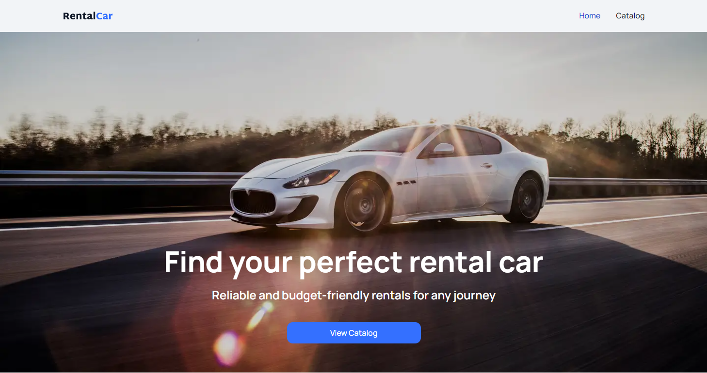
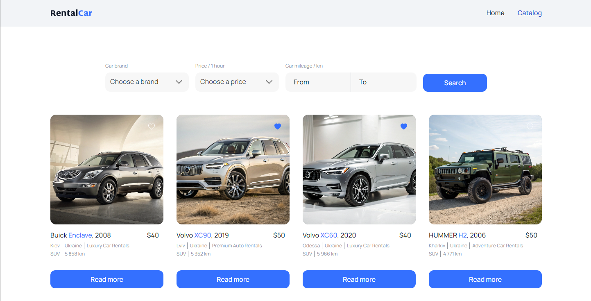
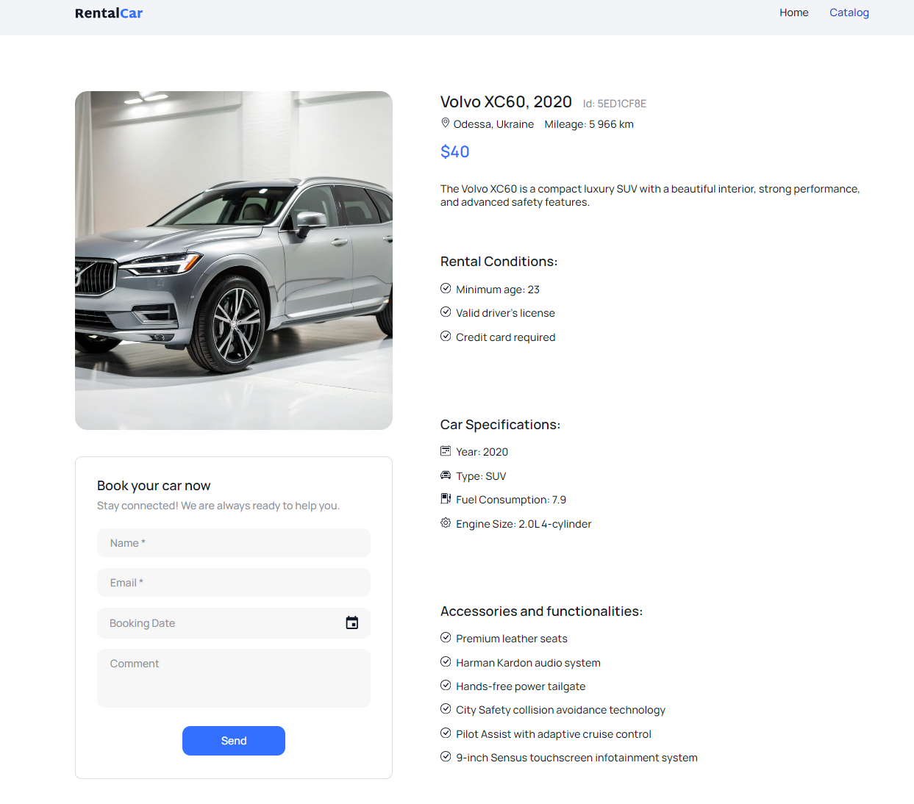

# 🚗 Car Rental System

Сучасна система оренди автомобілів з інтуїтивним інтерфейсом та зручним функціоналом для пошуку, фільтрації та бронювання транспорту.

## 📋 Короткий опис

Car Rental - це веб-додаток, створений для спрощення процесу оренди автомобілів. Система надає користувачам можливість переглядати каталог доступних автомобілів, застосовувати фільтри для пошуку потрібного транспорту, переглядати детальну інформацію про кожен автомобіль та додавати улюблені варіанти до списку вподобань.

## ✨ Основні функції

### 🏠 Головна сторінка

- Привітальний інтерфейс з презентацією сервісу
- Швидкий доступ до каталогу автомобілів

### 🚙 Каталог автомобілів

- **Перегляд каталогу**: Відображення всіх доступних автомобілів у вигляді карток
- **Розумна пагінація**: Завантаження додаткових автомобілів за запитом ("Load more")
- **Детальна інформація**: Повна інформація про кожен автомобіль (бренд, модель, рік, ціна, пробіг, тип)

### 🔍 Система фільтрації

- **Фільтрація за брендом**: Вибір конкретного виробника автомобіля
- **Цінова категорія**: Встановлення максимальної ціни оренди за годину
- **Пробіг**: Налаштування діапазону пробігу автомобіля (від/до)
- **URL синхронізація**: Фільтри зберігаються в URL для можливості поділитися посиланням
- **Персистентність**: Фільтри зберігаються при оновленні сторінки

### ❤️ Система вподобань

- **Додавання/видалення**: Можливість додати автомобіль до улюблених одним кліком
- **Локальне зберігання**: Вподобані автомобілі зберігаються між сесіями
- **Візуальні індикатори**: Чітке відображення статусу вподобаних автомобілів

### 📱 Адаптивний дизайн

- Повністю адаптований для всіх типів пристроїв
- Оптимізований користувацький досвід на мобільних пристроях та планшетах

### 📅 Система бронювання

- **Вибір дати**: Інтуїтивний календар для вибору дати оренди
- **Валідація**: Неможливість вибору минулих дат
- **Форматування**: Відображення дат у зручному форматі (дд.мм.рррр)

## 🛠 Технології

**Frontend:**

- **React 18** - Сучасна бібліотека для створення користувацьких інтерфейсів
- **Redux Toolkit** - Управління станом додатку
- **Redux Persist** - Збереження стану між сесіями
- **React Router** - Маршрутизація в додатку
- **MUI X Date Pickers** - Компоненти для роботи з датами
- **CSS Modules** - Модульні стилі для компонентів
- **Axios** - HTTP клієнт для API запитів
- **Clsx** - Утиліта для умовних CSS класів

**Додаткові інструменти:**

- **Vercel** - Хостинг та деплой
- **Git** - Контроль версій

## 🚀 Встановлення та запуск

### Системні вимоги

- Node.js (версія 16.0 або вище)
- npm або yarn

### Кроки встановлення

1. **Клонування репозиторію**

```bash
git clone https://github.com/tymur-lykho/rental-tz.git
cd rental-tz
```

2. **Встановлення залежностей**

```bash
npm install
# або
yarn install
```

3. **Запуск в режимі розробки**

```bash
npm run dev
# або
yarn run dev
```

Додаток буде доступний за адресою `http://localhost:3000`

### 🏗 Збірка для продакшену

```bash
npm run build
# або
yarn build
```

## 📖 Використання

1. **Перегляд каталогу**: Перейдіть до розділу "Catalog" для перегляду всіх доступних автомобілів

2. **Застосування фільтрів**:

   - Виберіть бренд автомобіля з випадаючого списку
   - Встановіть максимальну ціну оренди
   - Вкажіть бажаний діапазон пробігу
   - Натисніть "Search" для застосування фільтрів

3. **Додавання до вподобань**: Натисніть на іконку серця на картці автомобіля

4. **Перегляд деталей**: Клікніть на зображення або назву автомобіля для перегляду детальної інформації

5. **Поділитися фільтрами**: Скопіюйте URL сторінки з застосованими фільтрами для поділитися з іншими

## 🌟 Особливості проекту

- **Оптимізована продуктивність**: Lazy loading та оптимізовані запити до API
- **SEO-дружній**: Правильна структура URL та метаданих
- **Доступність**: Дотримання стандартів веб-доступності
- **Модульна архітектура**: Легко розширювана структура коду
- **Type Safety**: Використання сучасних практик розробки

## 🤝 Внесок у проект

1. Форкніть проект
2. Створіть feature branch (`git checkout -b feature/AmazingFeature`)
3. Зробіть коміт змін (`git commit -m 'Add some AmazingFeature'`)
4. Зпуште branch (`git push origin feature/AmazingFeature`)
5. Відкрийте Pull Request

## 📄 Ліцензія

Цей проект розповсюджується під ліцензією MIT. Дивіться файл `LICENSE` для додаткової інформації.

## 👨‍💻 Автор

**Tymur Lykho**

- GitHub: [@tymur-lykho](https://github.com/tymur-lykho)
- Email: tima.likho@gamil.com
- LinkedIn: [Tymur Lykho](https://linkedin.com/in/tymur-lykho)

## 🙏 Подяки

- Команді React за чудову бібліотеку
- Спільноті Redux за потужні інструменти управління станом
- Усім контриб'юторам, які допомагали покращувати проект

---

⭐ Якщо проект вам сподобався, поставте зірку на GitHub!

## 📸 Скріншоти

### Головна сторінка



### Каталог з фільтрами



### Детальна інформація про автомобіль



---

**Live Demo**: [https://rental-tz-git-main-tymur-lykhos-projects.vercel.app/](https://rental-tz-git-main-tymur-lykhos-projects.vercel.app/)
